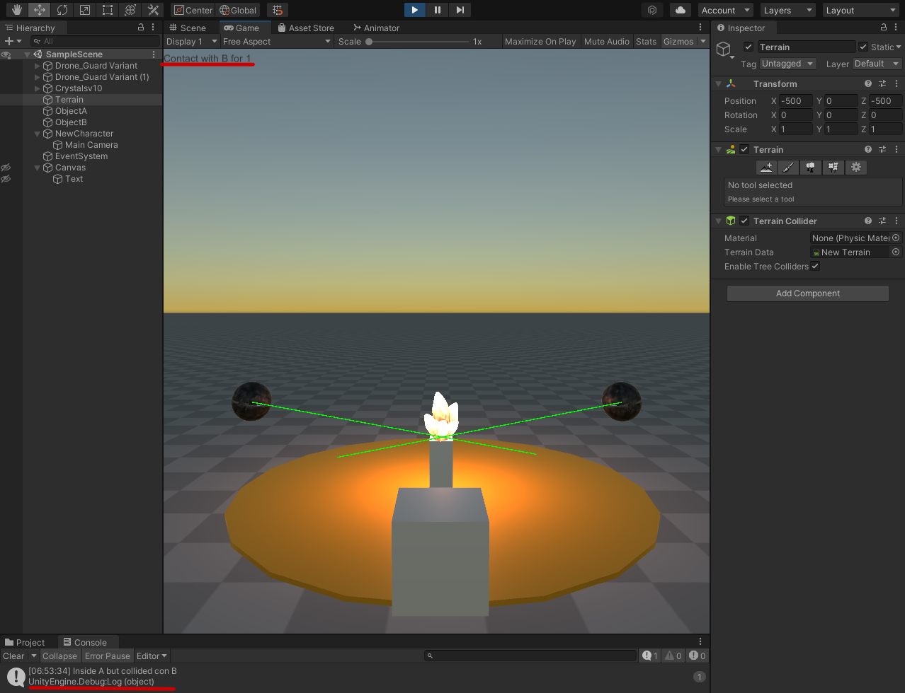
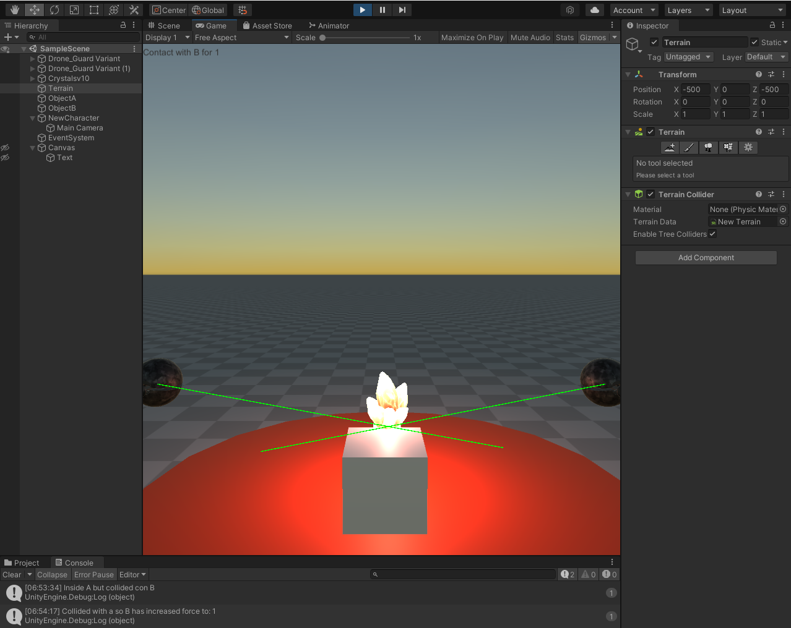

# II-P3

En esta practica he creado una escena simple, donde tenemos un objeto de tipo cilindro en el suelo (actuando como Objeto B), un objeto rectangulo que actua como objeto A, unos Drones que actuan como la esfera y una piedra que se utiliza para que los drones miran a este si el jugador se acerca.

> Cuando el jugador colisiona con un objeto de tipo B, el objeto A mostrará un texto en una UI de Unity. Cuando toca el objeto A se incrementará la fuerza del objeto B

Como podemos observar en la siguiente imagen, en el momento que el jugador collisiona el objeto B, el objeto A imprime en la UI (arriba izquierda) cuantas veces se lanzado este evento:

En el momento que hay collision con el Objeto a, el objeto B incrementa la fuerza que tiene:

> Cuando el jugador se aproxima a los cilindros de tipo A, los cilindros de tipo B cambian su color y las esferas se orientan hacia un objetivo ubicado en la escena con ese propósito. Consultar información de la clase Vector3: LookAt, RotateTowards, ...

Cuando el jugador se acerca a A, el cilindro B empieza cambiar su color, dependiendo de la distancia que tiene el jugador al objetoA. En el mismo momento los drones empiezan a vigilar mejor la piedra:

> Implementar un controlador que mueva el objeto con wasd

Este controlador esta implementado en el jugador.

> Buscar información de Debug.DrawRay y utilízala para depuración.

Podemos observar en el video a continuacion (o gif anterior) que los drones tienen un Ray que apunta hacia la direccion a donde miran, este fue implementado utilizando Debug.DrawRay. Para poder verlo en el juego tenemos que activar los Gizmos.

## Video Demonstrando funcionamiento:

(File is also in this repo, with name interaction.mp4)

https://user-images.githubusercontent.com/60736352/139681504-92fb58e1-a036-47c5-bfaf-f3590ab1e550.mp4

